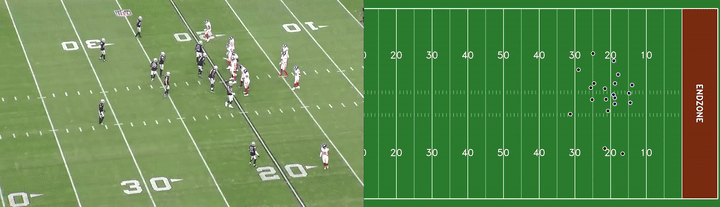
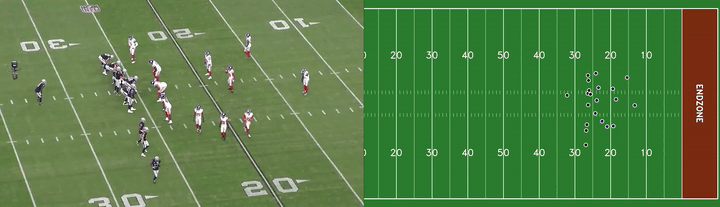
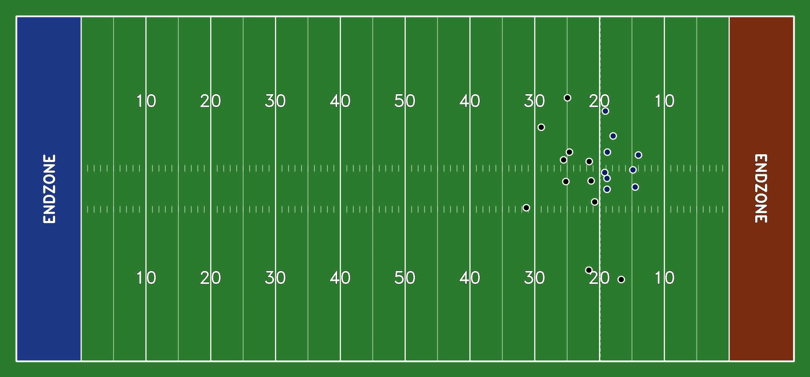

# Football Player Tracking And Homography Project

A computer vision pipeline that maps detected football players from video into standardized field coordinates using homography. This enables spatial analysis such as player positioning, spacing, and movement relative to the field.

## Overview
This project takes in COACH-22 sideline film and detects field landmarks to compute a planar homography. It then projects player detections into a standardized football field coordinate system.

## Visual Demos

### 1. Standardized Player Mapping
Transforms broadcast perspective into a 120-yard coordinate system
 

### 2. Receiver Routes & Spatial Analytics
Creates a path of all pass catchers and calculates there speed and seperation

### 3. Inverse Homography Overlay
Field projection

### 4. Debug & Coordinate Verification
Tracking of player movement and animating it on a 2D field

## Features
- Processes football video frames.
- Detects field landmarks including yard numbers, yardlines, sidelines, and hash marks.
- Computes a homography between image space and field space with broadcast-angle resilience.
- Projects detected player positions onto a standardized field model.
- Includes unsupervised team identification using K-Means clustering and UMAP.
- Outputs annotated visualizations, 2D player mappings, and debug coordinate data.

## Tech Stack
- Language: Python

- ML: PyTorch, scikit-learn

- Computer Vision: OpenCV, NumPy

- Utilities: tqdm, python-dotenv, pathlib

- Annotation/Visualization: supervision

- Model Inference: Roboflow Inference

## Directory Structure
- data/2d_player_maps/: 2D Bird's-eye view tracking videos.

- data/debug_coordinates/: Diagnostic videos showing model confidence and world coordinates.

-  data/inverse_homography/: Broadcast frames with projected field grids.

- data/videos/: Source footage and processed source clips.

## Roadmap
- Add player number identification.

- Integrate real-time speed and acceleration metrics.

